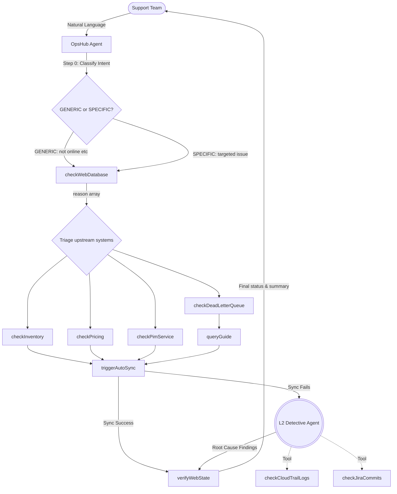

# 🚀 Bedrock AgentCore Operations Hub

An enterprise-grade **Autonomous Operations Hub** built on the **Amazon Bedrock AgentCore** platform. Demonstrates a production-grade **self-healing agent** with intent-aware triage, reason-driven upstream investigation, closed-loop verification, and automated evaluations — all powered by the **Strands Agents SDK**.

---

## 🛠️ Tech Stack
*   **Orchestration**: [@strands-agents/sdk](https://www.npmjs.com/package/@strands-agents/sdk) — Graph-based agentic AI
*   **Architecture**: Agent-to-Agent (A2A) Orchestration
*   **Model**: Amazon Bedrock — Claude 3.5 Sonnet v2 (`20241022`)
*   **Runtime**: AWS Lambda (**Node.js 22.x**)
*   **Memory**: AgentCore Episodic Memory (fast-path recall)
*   **Deploy**: Serverless Framework **v4**
*   **Language**: TypeScript 5.9+

---

## 🏗️ Architecture



---

## 🧠 Reasoning Cycle

The agent follows a strict 5-step protocol for every user request:

| Step | Action | Description |
|:---|:---|:---|
| **0. Intent** | Extract & Classify | Classify user complaint as GENERIC (vague) or SPECIFIC (targeted) |
| **1. Web Check** | `checkWebDatabase` | Always the first tool call — get current web state and reason array |
| **2. Upstream** | `checkInventory` / `checkPricing` / `checkPimService` | Only query systems flagged by reason array or user intent |
| **3. Remediate** | `triggerAutoSync` | Separate sync call per discrepancy found (inventory, price, or pim) |
| **4. Verify** | `verifyWebState` | Closed-loop confirmation the fix worked |
| **5. Summarize** | Agent response | Reports findings, actions taken, and final verified state |

---

## 💡 Scenario Examples

### Generic: "Why is prod000 not online?"
```
checkWebDatabase → NOT_SELLABLE [inv=0, price=$0]
  checkInventory + checkPricing (parallel, reason-driven)
    triggerAutoSync(inventory) + triggerAutoSync(price)
      verifyWebState → SELLABLE ✅
```

### Specific: "I think the price is wrong for prod666"
```
checkWebDatabase → SELLABLE (but pricing pre-marked by intent)
  checkPricing → upstream $24.99 ≠ web $19.99
    triggerAutoSync(price)
      verifyWebState → price updated ✅
```

### Episodic Memory Fast-Path: "Check SKU 1029 again"
```
(memory recall: recently fixed)
  triggerAutoSync(inventory) immediately
    verifyWebState → SELLABLE ✅
```

### Agent-to-Agent (A2A) Handoff: "Repeated sync failures"
```text
triggerAutoSync(inventory) → FAILS (Database Timeout)
  call delegateToL2Detective
    [L2Detective Agent Wakens]
      checkCloudTrailLogs + checkJiraCommits
    [L2Detective Agent Returns verdict]
  OpsHub Agent relays root cause to user
```

---

## 🚀 Setup & Usage

### 1. Install Dependencies
```bash
nvm use 22
npm install
```

### 2. Deploy to AWS
```bash
npm run deploy
```

### 3. Run Automated Evaluations
```bash
npm run eval
```
*Runs 5 scenarios covering generic triage, specific complaints, episodic memory, PIM metadata, and full reconciliation.*

---

## 📂 Project Structure
*   `src/agent.ts`: Core orchestrator — 9 tools, A2A Sub-Agent, intent-aware system prompt, Strands SDK agent.
*   `src/evaluator.ts`: Evaluation runner — scores agent accuracy against ground truth scenarios.
*   `config/eval.json`: 5 evaluation scenarios covering all reasoning paths.
*   `serverless.yml`: Infrastructure-as-code for Lambda and AgentCore deployment.

---

## ✍️ Author
**Palamkunnel Sujith** - *AI & Serverless Architect*
- LinkedIn: [https://www.linkedin.com/in/sujithpvarghese/]

## ⚖️ License
Distributed under the MIT License.
